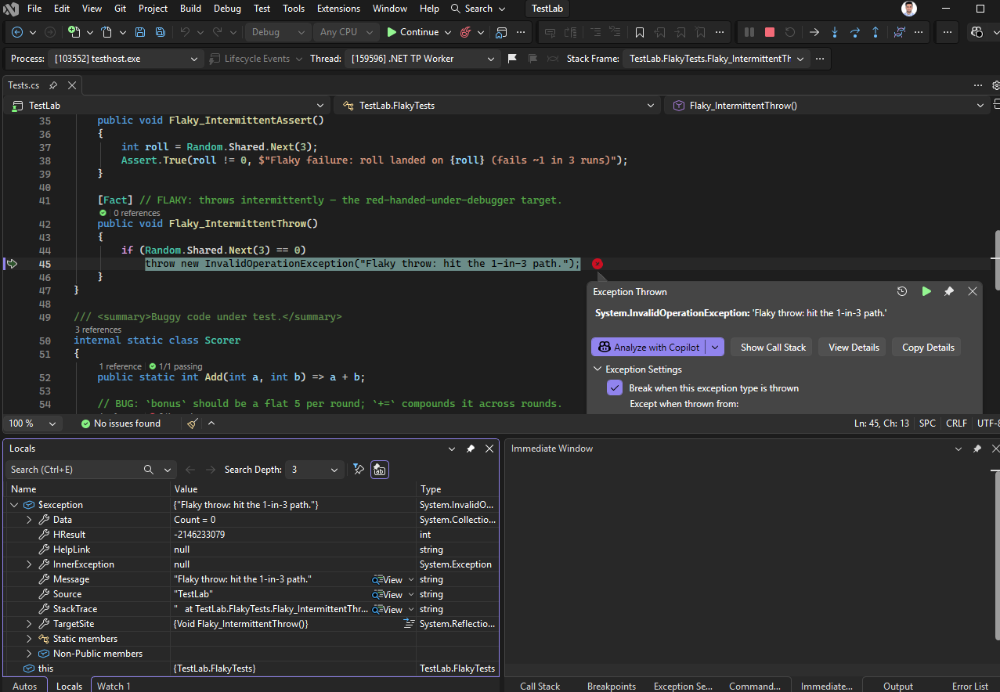
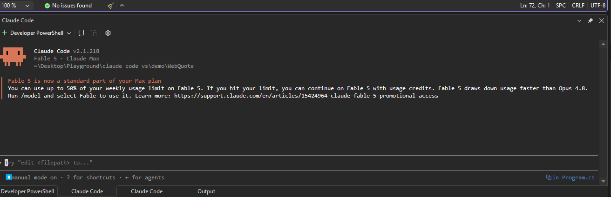
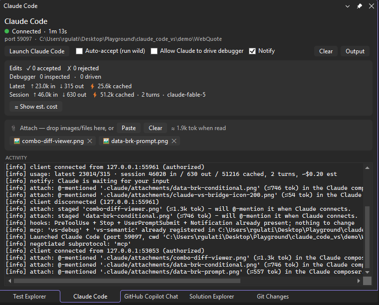

# Claude Code for Visual Studio

Bring [Claude Code](https://claude.com/claude-code) into **Visual Studio 2026**. The `claude` CLI does the agent work. This extension is the IDE half of Claude Code's integration protocol: a native diff window with accept and reject, automatic selection and compiler-diagnostics context, a live debugger Claude can read and drive, Roslyn code navigation with decompile, and a test runner that catches failures under the debugger.


*A fresh Claude session driving the Visual Studio debugger to find a bug that is invisible in the output, then opening the fix in the native diff.*

**Status:** community project, not affiliated with Anthropic. Visual Studio 2026 only for now. Tested against `claude` 2.1.191.

**Jump to a feature:** [Native diff](#a-native-diff-with-one-approval-step) · [Drive the debugger](#a-debugger-claude-can-drive) · [Data breakpoints](#break-when-a-value-changes) · [Catch flaky tests](#catch-a-failing-test-even-the-flaky-ones) · [Semantic navigation](#read-code-the-way-the-compiler-does) · [Integrated terminal](#claude-in-the-ides-own-terminal) · [Attach files](#attach-a-screenshot-or-any-file) · [The panel](#a-live-panel)

**More:** [What you get](#what-you-get) · [Requirements](#requirements) · [Install](#install) · [Quickstart](#quickstart) · [How it works](#how-it-works) · [Privacy and security](#privacy-and-security) · [Limitations](#limitations-and-known-issues) · [Troubleshooting](#troubleshooting) · [Build from source](#build-from-source)

## Why

Claude Code ships first-class IDE integration for VS Code and JetBrains, but not Visual Studio. This extension implements that same integration protocol natively for VS, so the CLI drives a real Visual Studio diff window and reads your selection and build errors instead of you copy-pasting into a terminal.

The demand for this is on the Claude Code tracker. These requests ask for what the extension provides:

- **Visual Studio support:** [#15942](https://github.com/anthropics/claude-code/issues/15942) for VS 2026, and [#70516](https://github.com/anthropics/claude-code/issues/70516) for VS 2022+.
- **A debugger Claude can use:** [#13865](https://github.com/anthropics/claude-code/issues/13865) for an interactive debug mode aimed at hard-to-reproduce runtime bugs, and [#27110](https://github.com/anthropics/claude-code/issues/27110) to expose debugger state, the variables and call stack, to Claude.
- **Reaching more IDEs, and stronger C#/.NET code intelligence:** [#1234](https://github.com/anthropics/claude-code/issues/1234) for IDEs beyond VS Code and JetBrains, and [#16360](https://github.com/anthropics/claude-code/issues/16360) for the C# code intelligence our Roslyn navigation provides.

## What you get

- **Native diff with a single accept/reject gate** - Claude's edits open in Visual Studio's diff viewer, and approving there is the only step (no duplicate y/n prompt in the terminal).
- **Reject with feedback** - reject an edit and tell Claude what to change, and it reconsiders with your note.
- **Run wild (auto-accept)** - a panel toggle that applies edits without opening the diff, for when you want to let it cook. Resets each session.
- **Diagnostics sharing** - Claude reads Visual Studio's compiler errors and warnings (C# and C++) and fixes them.
- **Semantic code navigation** - Claude asks Visual Studio's compiler (Roslyn) for the resolved meaning of your C# instead of grepping text: find-all-references, go-to-definition, find-implementations, and call/type hierarchies. These are the ground-truth answers text search gets wrong, like indirect and interface-dispatched references, the right overload, explicit interface implementations, and transitive callers for impact analysis. No debug session needed; it works whenever a C#/VB solution is loaded. Full reference: [`docs/SEMANTIC.md`](docs/SEMANTIC.md).
- **Live debugger** - while you are paused at a breakpoint, Claude sees your program's runtime state (call stack, variable values, threads) and, opt-in, can drive the debugger: continue, step, set breakpoints, break at the throw site of an exception, set a data breakpoint that breaks (or traces the full change history) the moment a value changes, attach to a running app (a hosted web service or desktop app, not just F5), and pause a hung process to untangle a deadlock by following the lock-ownership chain across threads to the exact cycle. Full reference: [`docs/DEBUGGER.md`](docs/DEBUGGER.md).
- **Test integration** - Claude discovers, runs, and debugs your unit tests through Visual Studio's Test Explorer engine: real per-test results (outcome, message, stack), re-run just the failures, and run a failing test under the debugger to stop at the fault, or hammer a flaky test until it fails and catch that iteration red-handed, paused inside the failure. Because it is the debugger's own session, a red test becomes a live investigation. Full reference: [`docs/TESTING.md`](docs/TESTING.md).
- **Selection context** - Claude automatically knows the file and lines you are looking at.
- **Claude in the IDE's own terminal** - Launch opens `claude` inside Visual Studio's docked Terminal tool window (the same group as Developer PowerShell), already connected - it docks and tabs like any other VS terminal instead of floating over your desktop. An **External console** button keeps the standalone-window option. Full reference: [`docs/QOL.md`](docs/QOL.md#claude-in-the-ides-own-terminal).
- **Attach screenshots and files** - the Windows CLI cannot take a pasted screenshot at all, so the panel is the paste point: Win+Shift+S, click **Paste** (or drop files from Explorer), and an `@` reference lands directly in the CLI's input box with the real image attached. Every attachment shows an estimated token cost *before* you send, Excel/video/archives attach too (Claude gets the path and reaches for a script), and staged copies live in a gitignored `.claude/attachments/`. Full reference: [`docs/QOL.md`](docs/QOL.md#attach-a-screenshot-or-any-file).
- **Notifications** - an in-IDE heads-up when Claude finishes responding or needs your input (a permission prompt, or it went idle waiting for you): a notification bar in Visual Studio, plus a taskbar flash when VS is in the background. For working in another window while it cooks. A panel toggle mutes it. Full reference: [`docs/QOL.md`](docs/QOL.md#notifications).
- **Live panel** - a dockable Claude Code panel: connection status, edit decisions, and token usage with estimated cost (latest call vs cumulative session).

## A closer look

A few of these are hard to picture from a bullet. Here they are running in the IDE.

### A native diff with one approval step

Claude's edits open in Visual Studio's own diff viewer, and approving there is the only step. There is no second yes/no prompt in the terminal. You can reject an edit and leave a note, and Claude reconsiders with your feedback. A panel toggle applies edits without the diff for when you want it to run ahead, and it resets each session so it is never silently left on.


### A debugger Claude can drive

While you are paused at a breakpoint, Claude reads your program's runtime state: the call stack, variable values, and threads. With driving turned on it also steps, sets breakpoints, and runs your code to corner a bug instead of guessing from the source. The clip above is a scoring function that returns the wrong total. Claude stopped inside the loop, stepped through the rounds, and watched a counter that should reset but did not.

It kept a running trace of what it saw at each round, which is how it caught the reset it was missing. For the input `{5, 3, 0, 4, 2, 0, 6}`:

| round | points | combo (after) | total | should be |
|---|---|---|---|---|
| 0 | 5 | 1 | 5 | 5 |
| 1 | 3 | 2 | 11 | 11 |
| 2 | 0 | **2, stays** | 11 | 11 |
| 3 | 4 | 3 | 23 | **15** |
| 4 | 2 | 4 | 31 | **19** |
| 5 | 0 | **4, stays** | 31 | 19 |
| 6 | 6 | 5 | **61** | **25** |

It has grown well past stepping. Claude can attach to a program that is already running (a hosted web service or a desktop app, not just F5), break at the throw site of an exception instead of the catch that swallows it, and pause a hung process to walk a deadlock back to the exact cycle. Full tool list and worked walkthroughs are in [`docs/DEBUGGER.md`](docs/DEBUGGER.md).

### Break when a value changes

Point Claude at a field and it stops the moment that field is written, or traces every value the field takes, in order. It can watch conditionally (break only when the value goes below zero, for example) and on several fields at once. Visual Studio's own UI can set this, but there is no automation API for it, so the extension arms it through a bundled debug-engine component. That makes it new ground for catching the write that corrupts your state.

The plain watch records every write, so the corrupting step is obvious at a glance, and the conditional watch (`< 0`) breaks on exactly that one:

| # | value (cents) | written by | |
|---|---|---|---|
| 1-3 | 0 → 30000 → 42000 → 54000 | `AddItems` | three line items |
| 4 | 54000 → 48600 | `ApplyBulkDiscount` | 10% off |
| 5 | 48600 → 52488 | `ApplyTax` | +8% tax |
| 6 | 52488 → **-47512** | `ApplyLoyaltyCredit` | the corruption |

The full data-breakpoint reference is in [`docs/DEBUGGER.md`](docs/DEBUGGER.md#break-when-a-value-changes-data-breakpoints).

### Catch a failing test, even the flaky ones

Claude discovers, runs, and debugs your unit tests through Visual Studio's Test Explorer engine. You get real per-test results (outcome, message, and stack), and after a fix it re-runs only the tests that failed. The test tools sit on top of the debugger, so a red test becomes a live investigation: Claude can launch one failing test and stop at the throw with the exception and locals in view. It can also loop a flaky test until the failing run happens and leave you paused inside that run, holding the state that caused it.



Full tool list and the worked flow are in [`docs/TESTING.md`](docs/TESTING.md#catch-a-flaky-test-red-handed).

### Read code the way the compiler does

Most assistants navigate code by searching text, which misses indirect references and over-counts on comments and same-named symbols. This gives Claude Visual Studio's resolved model of your C# (Roslyn): find-all-references, go-to-definition, find-implementations, and call and type hierarchies, resolved through interfaces, overrides, and overloads. It also reads the decompiled body of a method inside a referenced DLL, which searching your repo cannot do. Point it at a framework or NuGet call and it returns the real decompiled C#, and for core .NET types it fetches the actual runtime source via SourceLink.

| Tool | What it caught that a text search misses |
|---|---|
| find-implementations | `Triangle`'s **explicit** `IShape.Area`, which `.Area()` or `: IShape` never ties back to the interface |
| type-hierarchy | `Circle` and `Square` reach `IShape` transitively through `ShapeBase`; grep on `: IShape` finds only the two direct implementers |
| call-hierarchy | the interface-dispatched callers of `IShape.Area`, back to `Main`, that a search on the concrete `Circle.Area` would miss |
| go-to-definition | the right `Describe` overload at a call site, not all three declarations |
| decompile | the real body of `Enumerable.Sum` from the library, with `Math.Sqrt` falling back to SourceLink |

It needs no debug session and works whenever a C#/VB solution is open. Details are in [`docs/SEMANTIC.md`](docs/SEMANTIC.md).

### Claude in the IDE's own terminal

`claude` runs inside Visual Studio's docked **Terminal** tool window - the same terminal group as Developer PowerShell - instead of a separate console floating over your desktop. Under the hood this is VS 2026's own terminal engine, reached through an undocumented service, so the launch is guarded: any failure or stall falls back to the classic external console automatically. Prefer the standalone window anyway (a second monitor, or a session that survives closing VS)? The **External console** button next to Launch does exactly that. Details and known quirks: [`docs/QOL.md`](docs/QOL.md#claude-in-the-ides-own-terminal).



### Attach a screenshot, or any file

Pasting a screenshot into the Claude Code CLI on Windows silently does nothing (a [long-open upstream gap](https://github.com/anthropics/claude-code/issues/26679)), and a screenshot is not a file you can drag. The panel closes that gap: take the capture, click **Paste** (or Ctrl+V in the panel, or drop files from Explorer), and the extension stages it and pushes an `@` reference straight into the CLI's input box - the same `at_mentioned` protocol message the official VS Code plugin uses, verified to deliver the actual pixels, not just a path. You type your question around the chip and send.



Every attachment shows an **estimated token cost before you send** - on the chip's tooltip, and totaled next to the tray. A full screenshot and a 4K one both land near ~1.5k tokens (the API downscales), while a tight Win+Shift+S crop costs a fraction of that, and a 2 MB JSON log announcing *≈212k tokens* is your cue to ask Claude to Grep it instead of reading it whole. Formats Claude cannot read directly (Excel, video, archives) still attach - the chip is labeled, Claude gets the path, and it reaches for a script or tool on its own. BMPs are transcoded to vision-ready PNGs automatically. Files already in your workspace are referenced in place; everything else is copied into a gitignored `.claude/attachments/` so reads never hit a permission prompt.

### A live panel

A dockable Claude Code panel shows connection status, edit decisions, and token usage with an estimated cost for the latest call and the running session. It also holds the two safety toggles (apply edits without the diff, and allow Claude to drive the debugger), both off by default and both reset each session, plus a **Notify** toggle (on by default) that mutes the finished/needs-input notifications.


## Requirements

- Visual Studio 2026.
- The Claude Code CLI, installed and authenticated. See the [Claude Code docs](https://docs.claude.com/claude-code). This extension makes no model calls and does no agent work itself, so it needs the CLI.
- Tested against `claude` 2.1.191.

## Install

- **Marketplace:** search for *Claude Code for Visual Studio* in **Extensions > Manage Extensions**, or install from the [Visual Studio Marketplace](https://marketplace.visualstudio.com/items?itemName=firish.bridgev1).
- **Sideload:** download the `.vsix` from [Releases](https://github.com/firish/claude_code_vs/releases) and double-click it.

## Quickstart

1. Open your project or solution in Visual Studio 2026.
2. Open the **Claude Code** panel (**View > Other Windows > Claude Code**) and click **Launch Claude Code**. It is also on the **Tools** menu.
3. `claude` opens in Visual Studio's docked **Terminal** window, already connected to the IDE, so you do not need `/ide`. The panel pill turns green and reads **Connected**. (Want a standalone window instead? Click **External console**.)
4. Ask Claude to make a change. Its edit opens as a diff, and you click **Accept**, **Reject**, or **Reject with feedback**.

Diagnostics need a loaded project, not a loose file in Open-Folder mode, for the compiler to analyze it.

To let Claude debug: set a breakpoint, tick **Allow Claude to drive debugger** in the panel, start debugging, then ask it to investigate. Reading runtime state works without the toggle. The toggle only gates driving execution. See [`docs/DEBUGGER.md`](docs/DEBUGGER.md).

For a full first-run walkthrough with screenshots, a panel tour, and troubleshooting, see [`docs/GETTING-STARTED.md`](docs/GETTING-STARTED.md).

## How it works

This is a protocol bridge, not a re-implementation of the agent. On launch the extension:

1. Starts a localhost WebSocket server and writes a lockfile at `~/.claude/ide/<port>.lock`.
2. Launches `claude` with `ENABLE_IDE_INTEGRATION` and the bridge port, so it auto-connects and speaks MCP over the socket.
3. Implements the IDE tools the CLI drives: `openDiff`, `openFile`, `getDiagnostics`, selection updates, and the diff-tab lifecycle.

To make the Visual Studio diff the single approval point, the extension installs a small PreToolUse hook into your workspace's `.claude/settings.json` that routes proposed edits through the diff. The CLI does all agent work, and the extension never makes model calls.

For debugger access it adds a `UserPromptSubmit` hook that injects live break state when you are paused, and a second MCP server, `vs-debug`, reached through a small stdio shim registered in your workspace `.mcp.json`. Reading runtime state is always allowed. Driving execution is opt-in behind the panel toggle. The same `vs-debug` server carries the test-runner tools, co-located with the debugger on purpose so a failing or intermittent test can be caught under it. For semantic navigation it adds a third MCP server, `vs-semantic`, backed by the live Roslyn workspace and read-only. Details live in [`docs/DEBUGGER.md`](docs/DEBUGGER.md), [`docs/TESTING.md`](docs/TESTING.md), and [`docs/SEMANTIC.md`](docs/SEMANTIC.md).

## Privacy and security

- The bridge binds to **127.0.0.1 only** and validates an auth token from the lockfile on every connection. The token is never logged.
- The extension makes no network calls and no LLM calls of its own. All AI work is the `claude` CLI, under your own authentication.
- On Launch it writes these into your workspace's `.claude/` folder and merges hook entries into `.claude/settings.json`, preserving existing content:
  - `vs-permission-hook.ps1`, which routes Edit/Write/MultiEdit edits through the VS diff.
  - `vs-usage-hook.ps1`, which reports the transcript path so the panel can show token stats.
  - `vs-debug-context-hook.ps1`, which injects live break state into your prompt while you are paused.
  - `vs-notify-hook.ps1`, which reports when Claude needs your input so the extension can raise an in-IDE notification.
  - `vs-mcp-shim.ps1`, the stdio bridge for the `vs-debug` and `vs-semantic` MCP servers, registered in your workspace `.mcp.json`.
- Token cost is an estimate from hardcoded per-tier prices, shown only when you click *Show est. cost*.
- Attachments you paste or drop are staged in your workspace's `.claude/attachments/` (screenshots become PNGs there; out-of-workspace files are copied in). The folder carries its own `*` gitignore so nothing lands in your repo, staged copies are pruned after 7 days, and files already inside the workspace are referenced in place, never copied or deleted.

## Limitations and known issues

- Visual Studio 2026 only for now. A VS 2022 backfill is planned if there is demand.
- The integration protocol is undocumented and version-fragile, so a `claude` update could change it. Known-good: 2.1.191.
- Diagnostics need a loaded project. The Error List and Roslyn will not analyze loose files.
- Semantic navigation is C#/VB and needs a loaded project. It reads the Roslyn workspace, so it sees the solution open in VS rather than the CLI's working directory if they differ, and it does not cover C++ navigation.
- Debugger features target managed (.NET) code. Reading runtime state is always on, and driving execution is opt-in. Native and C++ runtime inspection is not covered.
- Test integration is for managed (.NET) test projects and needs a loaded solution. Coverage works, profiling is deferred, and the debug and flaky-catch tools are opt-in behind the debugger-drive toggle. See [`docs/TESTING.md`](docs/TESTING.md).
- Token stats refresh on edits, which is the reliable hook trigger, so a chat-only turn may not update them right away.
- Cost figures are estimates, not billing.
- Attachments: images read directly must be PNG/JPEG/GIF/WebP under 5 MB (bigger ones attach with a downscale note; BMPs are transcoded). Excel, video, archives and other binaries attach as paths for Claude's tools rather than direct reads. Attachment token figures are estimates.

## Troubleshooting

- **Panel says "Waiting for CLI":** click **Launch Claude Code**, or run `/ide` in a `claude` terminal and pick *Visual Studio*.
- **The debugger, test, or semantic tools are missing:** the panel warns when the `vs-debug` and `vs-semantic` servers did not load for a session. Relaunch Claude from the panel (or from inside the workspace folder) and approve the project MCP servers if the CLI prompts.
- **New files land in the wrong folder:** launch from the extension, which pins the working directory to your workspace, or run `claude` from inside the repo.
- **getDiagnostics returns nothing:** open the code as a project and confirm the error appears in the Error List.
- **`claude` opened in a separate console instead of the docked terminal:** the native terminal path failed or timed out and fell back (by design - the reason is in **Output > Claude Code**). Everything still works.
- **The Claude Code terminal tab turned into Developer PowerShell after restarting VS:** expected - VS restores terminal tabs with the default shell, and the old session's port would be stale anyway. Close the leftover tab and click **Launch Claude Code** again.
- **An attachment chip didn't show up in the CLI's input box:** the CLI drops the reference if it was mid-turn (or its agents view was focused) when you attached. Click the chip in the panel to send it again; chips staged before Claude connects send themselves on connect.
- **Filing a bug:** include the **Output > Claude Code** pane contents and your `claude --version`.

## Build from source

Requires Visual Studio 2026 with the Visual Studio extension development workload.

```powershell
msbuild src/ClaudeCodeVS/ClaudeCodeVS.csproj /t:Rebuild /p:Configuration=Release
```

Press F5, or launch `devenv /rootsuffix Exp`, to debug in the experimental instance. Architecture and contributor guidance live in [`CLAUDE.md`](CLAUDE.md). Future work lives in [`ROADMAP.md`](ROADMAP.md).

## Contributing

Issues and PRs are welcome. The protocol contract is undocumented and has regressed before, so if you bump the `claude` CLI, please run the spike smoke test in `spike/` and note the version.

## License

[MIT](LICENSE) © 2026 Rishi Gulati. Not affiliated with Anthropic. "Claude" and "Claude Code" are trademarks of Anthropic, used here only to describe interoperability.
