# Live debugger integration

Most coding assistants only see your source. This extension also gives Claude your program's **runtime state** while it runs: where execution is paused, the call stack, the values of your variables, and the threads. With a panel toggle on, Claude can also **drive** the debugger. It steps, sets breakpoints, breaks at the throw site of an exception, attaches to a running process, and pauses a hung one. That lets it corner a bug by watching the code run, instead of guessing from the source.

The `claude` CLI does the agent work. The extension exposes Visual Studio's live debugger to it over the same localhost bridge that powers the diff and diagnostics features.

**Jump to:** [Watch it work](#watch-it-work) · [Attach to a running app](#break-at-the-throw-in-an-app-that-is-already-running) · [Deadlocks](#untangle-a-deadlock) · [Data breakpoints](#break-when-a-value-changes-data-breakpoints) · [Async call stacks](#follow-an-async-call-across-awaits) · [Memory leaks](#find-a-memory-leak)

**Reference:** [How it reaches the model](#how-it-reaches-the-model-three-channels) · [Tool catalog](#tool-catalog) · [Safety](#safety) · [Limitations](#limitations) · [Fixtures to try](#fixtures-to-try)

---

## Watch it work

The clearest way to see the point is a bug that never shows up in the output. [`demo/ComboScore`](../demo/ComboScore) is a scoring routine that returns the wrong total, and nothing in the source reads as wrong. A fresh `claude` session, with no idea what the bug was, drove the Visual Studio debugger and found it in about a minute and a half.

<video src="https://github.com/firish/claude_code_vs/releases/download/media/debugger-walkthrough.mp4" controls muted playsinline width="900"></video>

The prompt was just:

> hi, my comboscorer is partially correct. can you use the debugger and check whats tripping up?

It read the source, loaded the `vs-debug` tools, set a breakpoint at the top of the loop, and started the session with `vs_start_debugging`. Then it stepped round by round, watching the `combo` counter.

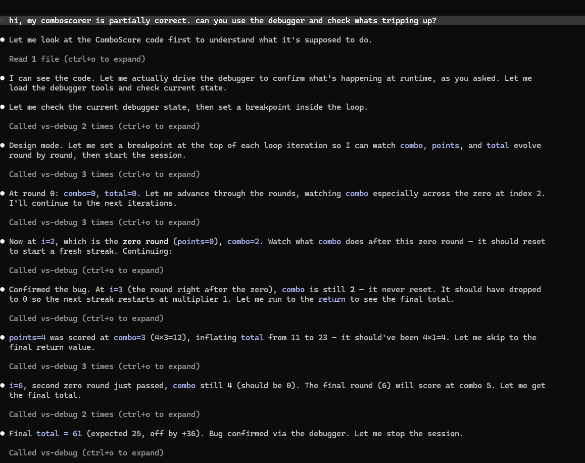

For the input `{5, 3, 0, 4, 2, 0, 6}` it kept this trace:

| round | points | combo (after) | total | should be |
|---|---|---|---|---|
| 0 | 5 | 1 | 5 | 5 |
| 1 | 3 | 2 | 11 | 11 |
| 2 | 0 | **2, stays** | 11 | 11 |
| 3 | 4 | 3 | 23 | **15** (4×1) |
| 4 | 2 | 4 | 31 | **19** |
| 5 | 0 | **4, stays** | 31 | 19 |
| 6 | 6 | 5 | **61** | **25** |

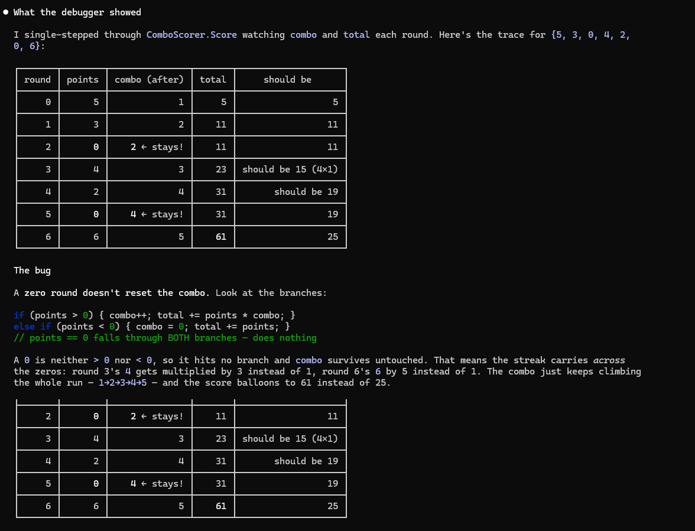

The combo multiplier never resets on a zero round. `if (points > 0)` and `else if (points < 0)` both miss `points == 0`, so a zero round falls through and the streak carries across it, which inflates the score to 61 instead of 25. Claude proposed resetting the combo on a non-positive round, and the fix opened in the diff.

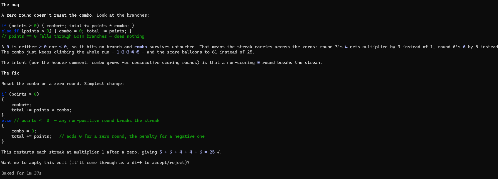

You cannot see that by reading the code. It only shows up when you watch `combo` stay at 2 across the zero at round 2. That is the difference between reading code and debugging it.

---

## What it can do

Each of these is a real run against a fixture in [`demo/`](../demo). Open the `.sln`, turn on **Allow Claude to drive debugger** in the panel, and Launch Claude Code.

### Break at the throw, in an app that is already running

F5 is not always an option. A hosted web service or a desktop app is already up, and the bug is in a request handler or a UI action, not at startup. Claude can attach to that live process, arm a first-chance exception, trigger the path, and stop at the exact throw site.

[`demo/WebQuote`](../demo/WebQuote) is an ASP.NET Core API that stays running. `GET /quote/103` prices an order whose customer is null, so it throws a `NullReferenceException` deep in the handler, and a generic `catch` turns that into a bland 500. The status code tells you the endpoint is broken. It does not tell you where or why.

Claude ran the whole loop itself. It listed the local processes, attached to the running API, and armed break-on-thrown for `NullReferenceException`.

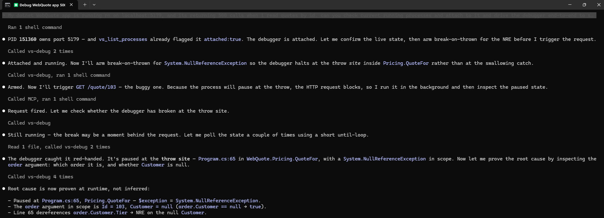

Then it triggered `GET /quote/103` with `curl`. The request thread stopped at the throw inside `Pricing.QuoteFor`, not at the `catch` that swallows it, with the null-customer order in scope.

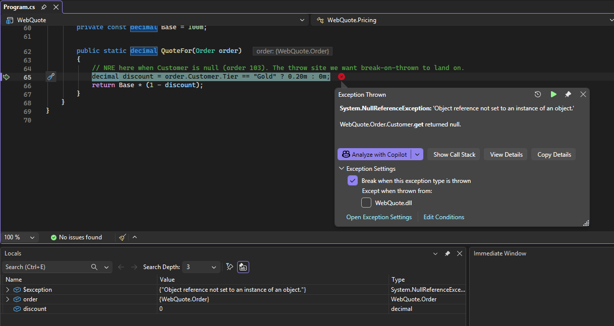

It named the cause, order 103 has a null `Customer`, and opened the one-line fix in the diff.

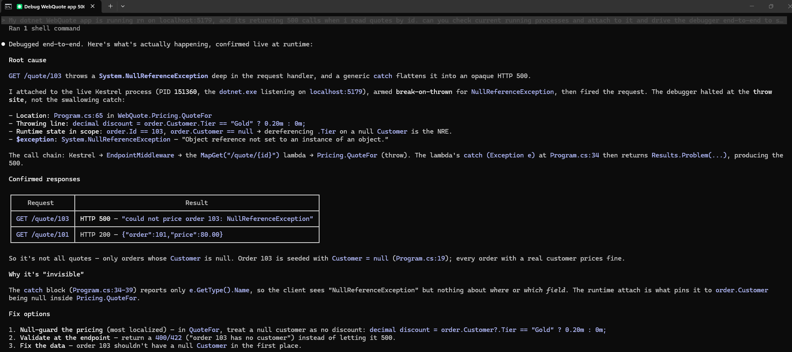

This is the case F5 cannot cover. The app was already running, and the break landed on a live request.

### Untangle a deadlock

A deadlocked program is the one case where a breakpoint is useless. Nothing runs, so nothing stops. [`demo/LockJam`](../demo/LockJam) runs five threads against three accounts, and three of them lock in a ring, so the process hangs forever.

Told only that the app was hung, Claude started the session, waited, and saw no break in 30 seconds, which is the deadlock signature. Then it used `vs_break_all` to pause the hung process, the only way in.

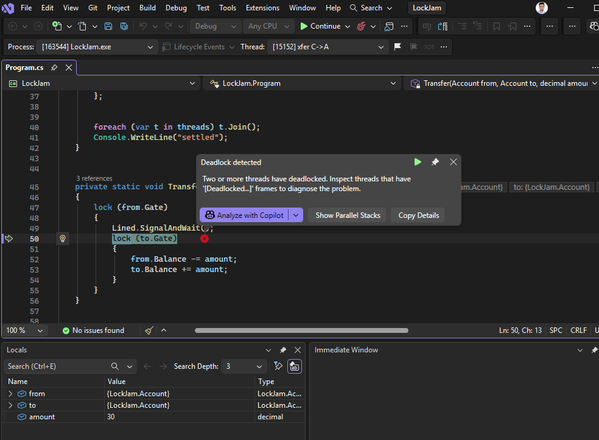

`vs_threads` came back with each stuck thread flagged as waiting on a lock, and each one carried a `lockOwnerThreadId`: the thread that holds what it wants. Those owner ids are the wait chain.

| thread | holds | blocked acquiring | owner it is waiting on |
|---|---|---|---|
| `xfer A→B` | A | B | `xfer B→C` |
| `xfer B→C` | B | C | `xfer C→A` |
| `xfer C→A` | C | A | `xfer A→B` |

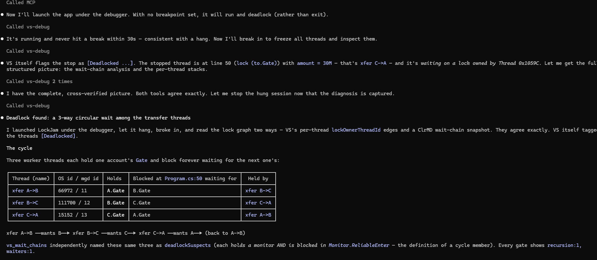

It reconstructed a clean `A → B → C → A` ring, and it correctly ignored the two decoys: a thread spinning on the CPU that never waits, and one parked on an empty semaphore that waits but is not in the cycle. The fix is a consistent lock order, which it also named.

### Break when a value changes (data breakpoints)

This is the one Visual Studio's own UI cannot set through any automation API, so it is new ground. Point Claude at a field, and it stops the instant that field is written, or records every value the field takes in order. It can watch conditionally, so it breaks only when the value goes below zero, and it can watch several fields at once.

[`demo/DataWatch`](../demo/DataWatch) prices one order by mutating `order.TotalCents` through four methods, and the total comes out negative. Nothing in the output says which of the four steps corrupted it, and because each write is in a different method, there is no single line to breakpoint.

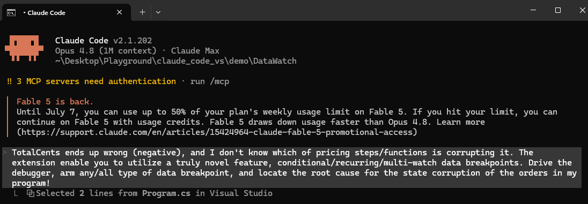

Claude paused where `order` was in scope and armed three watches at once: a plain watch on `order.TotalCents` for the full timeline, a conditional stop-on-change watch on `order.TotalCents` for `< 0`, and a second watch on `order.Writes`.

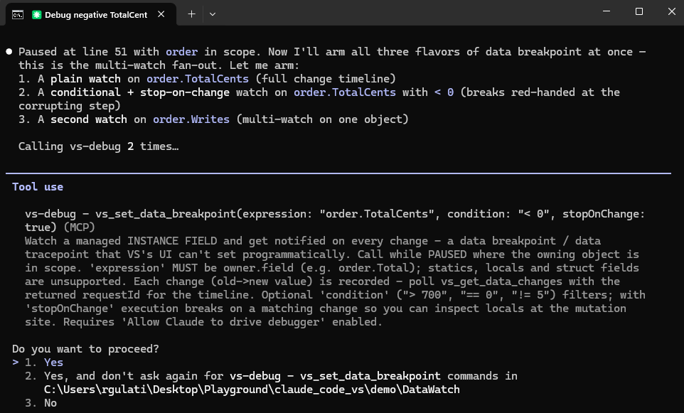

The plain watch recorded the whole write timeline, so the corruption is obvious at a glance. The last write is the one that breaks it.

| # | value | method | verdict |
|---|---|---|---|
| 1-3 | 0 → 30000 → 42000 → 54000 | `AddItems` | three line items |
| 4 | 54000 → 48600 | `ApplyBulkDiscount` | 10% off |
| 5 | 48600 → 52488 | `ApplyTax` | +8% tax |
| 6 | 52488 → -47512 | `ApplyLoyaltyCredit` | the corruption |

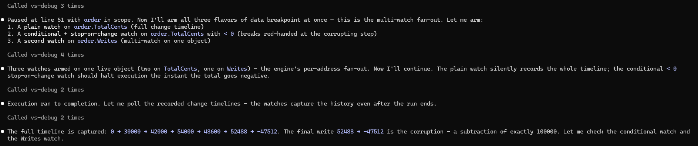

The conditional watch skipped the five good writes and broke exactly on the one that drives the total negative, inside `ApplyLoyaltyCredit`, where the live locals showed `creditCents = 100000` when it should be 1000. All three watches fired on the same object at once, which is the engine's per-address fan-out.

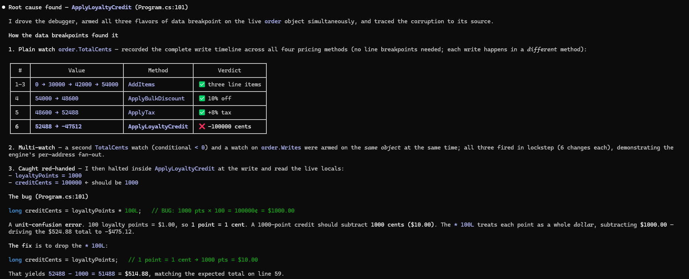

The bug is a unit mix-up. `loyaltyPoints * 100L` treats each loyalty point as a whole dollar, so it subtracts $1000 instead of $10 and drives the $524.88 total to -$475.12. Dropping the `* 100L` yields the expected $514.88.

A few constraints are worth knowing: the watched value must be a public **instance field**, not a property, local, or static; the debuggee is .NET Core 3.0+ and x64; and the stop lands one statement after the write, because a data breakpoint fires once the write completes.

### Follow an async call across awaits

When you pause inside an async method, the physical thread stack no longer holds the logical callers. It shows `MoveNext`, async-builder internals, and threadpool frames instead of the methods that actually called each other. `vs_async_stacks` rebuilds the logical chain from the async state machines on the heap.

[`demo/AsyncTrace`](../demo/AsyncTrace) is a three-level pipeline, `RunAsync` calling `ComputeAsync` calling `InnerAsync`, whose awaits resume on the threadpool. Paused inside `InnerAsync` on a continuation, Claude reconstructed the real caller chain that the thread stack hides.

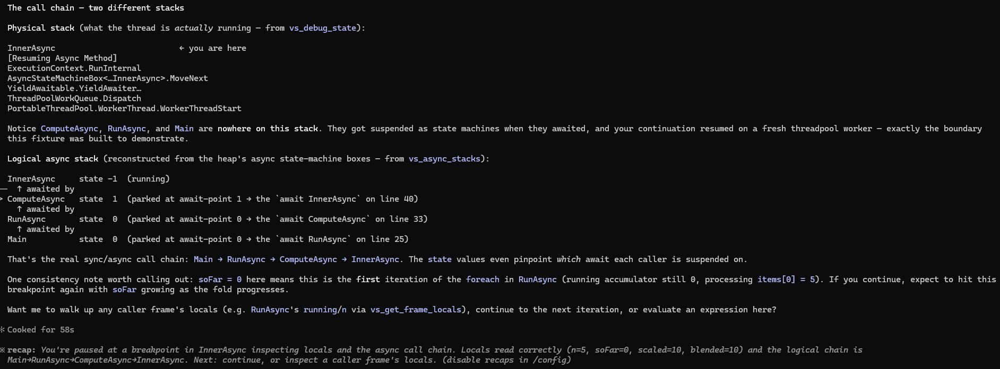

The current frame's locals read correct post-await values too, so an evaluation in that frame returns the right numbers rather than stale ones.

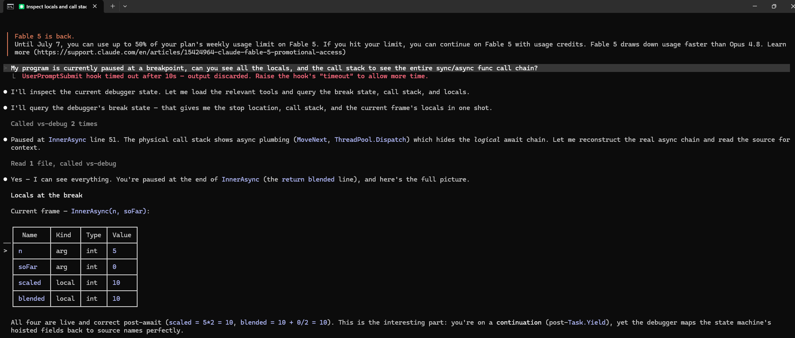

### Find a memory leak

For a slow leak or a starved thread pool, the question is not where execution is paused but what the heap looks like. [`demo/MemLoad`](../demo/MemLoad) leaks byte arrays into a static list and floods the thread pool.

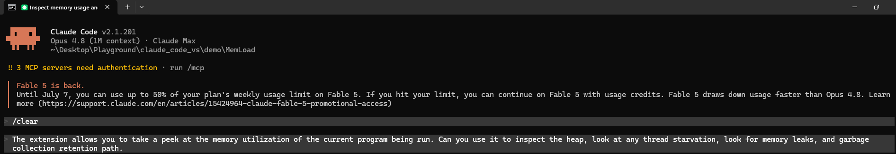

Claude baselined the heap, waited, and diffed it. `System.Byte[]` kept climbing, which is the leak. It then asked why that type was still alive, and `vs_gc_roots` traced the retention path back to the static `Retained` list that holds every array. It also flagged the thread pool as starved, with 64 blocked work items pinning every pool thread.

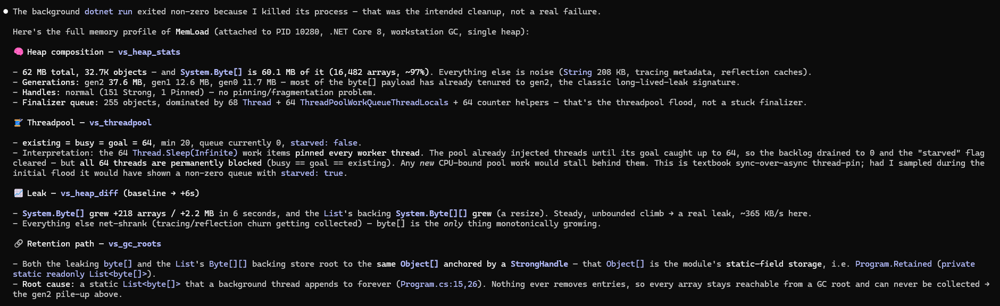

These reads come from a ClrMD snapshot taken out of process, so they run against a clone of the heap and coexist with the live debug session.

---

## How it reaches the model: three channels

A new IDE tool would not help here. Claude Code's IDE-integration protocol, the WebSocket the CLI connects to, is curated by the CLI. It surfaces only `getDiagnostics` (and `executeCode`) to the model and drives the rest itself, so a tool added there would never be called. Debug state reaches the model through the two channels that the CLI does surface: a hook (push) and a user MCP server (pull). Driving rides the same MCP server behind a safety gate.

### Push: break state at prompt time

When you submit a prompt while the debugger is paused, a `UserPromptSubmit` hook (`vs-debug-context-hook.ps1`) POSTs to the bridge's `/debug-context` endpoint. The bridge reads the live break state via EnvDTE on the UI thread and hands it back, and the hook injects it as `additionalContext`. So Claude starts the turn already knowing where you are stopped and what the values are, with no tool call. It only fires in break mode, so a normal turn gets no noise.

### Pull: inspect on demand (the `vs-debug` MCP server)

The bridge exposes a second MCP server at `POST /mcp` on its localhost `HttpListener`. The CLI reaches it through a small stdio shim (`vs-mcp-shim.ps1`) registered in your workspace `.mcp.json` under the server name `vs-debug`. The shim finds the live bridge (the most-specific workspace lockfile whose port is listening) and proxies newline-delimited JSON-RPC to `/mcp`. The tools run in-proc in C# against EnvDTE. The shim is a dumb pipe.

A user-registered `.mcp.json` server is the open plugin door, so the CLI surfaces all of its tools to the model. The IDE channel is a closed, curated protocol. Same dispatch code, a different relationship with the CLI.

### Drive: control execution (same server, gated)

Execution control sits behind the panel toggle **Allow Claude to drive debugger**, which is off by default, held in memory, and reset each Visual Studio session. When it is off, the drive tools refuse and do nothing. The hard part is that a drive command is asynchronous: you issue "step", then wait for the next break. An await-break engine handles it. It issues the EnvDTE command with `WaitForBreakOrEnd=false` so the UI thread never blocks, subscribes to `IVsDebuggerEvents.OnModeChange`, parks a `TaskCompletionSource`, and completes it on the next Break with the fresh snapshot, or on Design when the program ended. A 20 second timeout reports "still running" rather than hanging.

```
                 prompt-submit          on demand                control (gated)
  Claude (CLI) --UserPromptSubmit-->  --stdio JSON-RPC--> vs-mcp-shim.ps1
       |              hook                 (.mcp.json)            | HTTP POST /mcp
       |                |                                        v
       v                v                                  IdeWebSocketServer (127.0.0.1, auth)
  /debug-context <------|                                        |
       +--------------------------+-----------------------------+
                                  v
              DebuggerReader / DebuggerDriver  --EnvDTE / IVsDebugger-->  VS debugger (UI thread)
```

---

## Tool catalog

All tools live on the `vs-debug` MCP server and appear to the model as `mcp__vs-debug__*`. Reads are ungated. Drives require the "Allow Claude to drive debugger" toggle. Most need the debugger paused (break mode); otherwise the snapshot reports `{"mode":"run|design|unknown"}`.

### Inspect (read-only, ungated)

| Tool | What it returns |
|---|---|
| `vs_debug_state` | Mode, stop location, call stack (innermost first), and the current frame's args and locals with values. |
| `vs_list_breakpoints` | All breakpoints (file, line, function, enabled, hit count, condition). Works in any mode. |
| `vs_get_frame_locals` | Args and locals for a call-stack `frameIndex`, so you can walk up to callers. An optional `threadId` (from `vs_threads`) reads another thread's frame, for example each thread parked in a deadlock. |
| `vs_evaluate` | Evaluate an expression in a chosen frame, returning `{value, type, isValid}`. |
| `vs_expand` | Drill into an object graph to a given depth, returning a `{name, type, value, children}` tree. |
| `vs_threads` | Every thread with its call stack and location. The current thread is flagged, threads parked on a lock or wait are flagged (`waiting` / `waitOn`), and a contended-lock waiter carries `lockOwnerThreadId`, the holder to follow for a deadlock cycle. |
| `vs_exception` | The exception in scope (`$exception`) at a first-chance break or in a catch: type, message, and an expanded tree including `InnerException` and stack. |
| `vs_list_processes` | Local processes you can attach to (id and name, optionally name-filtered), flagged if already being debugged. |
| `vs_wait_chains` | Structured deadlock triage from a ClrMD snapshot: every held monitor with its owner thread and waiter count, each thread's held locks and blocked state, and `deadlockSuspects` (threads that hold a lock and are also blocked entering a monitor, which are the cycle members). Exact ownership, not text-derived. Pair with `vs_threads` for the explicit waiting-on edge. |
| `vs_async_stacks` | Logical async call-stack reconstruction from a ClrMD snapshot: walks the heap's async state-machine boxes and returns each in-flight async chain (innermost first) with its await-point `state`, the `RunAsync → ComputeAsync → InnerAsync` chain the physical stack hides. |
| `vs_heap_stats` | Memory snapshot: top managed types by total bytes, bytes per GC generation (gen0/1/2/LOH/POH), GC mode, GC-handle counts by kind, and finalizer-queue size with top finalizable types. |
| `vs_threadpool` | ThreadPool health: worker counts (min/max/existing/busy/goal), queued work-item backlog, and a `starved` flag, for the "async app hangs but nothing is deadlocked" case. .NET 6+ targets. |
| `vs_gc_roots` | "Why is this alive?" Give a type name or a `0x` address and get the retention path from a GC root to an instance, with `rootKind` (static, stack local, handle, finalizer). |
| `vs_heap_diff` | Leak finder. The first call baselines the heap; later calls report what grew, per type. A type that climbs across repeated calls is the leak, which you then trace with `vs_gc_roots`. `reset` re-baselines. |

> The six ClrMD tools (`vs_wait_chains`, `vs_async_stacks`, `vs_heap_stats`, `vs_threadpool`, `vs_gc_roots`, `vs_heap_diff`) run ClrMD **out of process**. ClrMD cannot load in-proc in devenv, because its `System.Collections.Immutable` bind collides with devenv's own binding policy and throws a `MissingMethodException`. So a bundled worker, `ClrMdWorker.exe`, carries its own binding config, takes the snapshot in a separate process, and returns JSON. The snapshot is a `PssCaptureSnapshot` fork, so it reads a clone and coexists with the live session. All of them need an active session, are managed-only, and take an optional `pid` for multi-process sessions.

### Drive (execution and breakpoints, gated)

| Tool | Action |
|---|---|
| `vs_continue` | Resume to the next breakpoint or program end, then return the new state. |
| `vs_step_over` / `vs_step_into` / `vs_step_out` | The three step modes, each awaiting the next break. |
| `vs_run_to_line` | Run to a `file:line`, using a temporary breakpoint under the hood. |
| `vs_break_all` | Pause a running or hung debuggee and return the new state. This is the way into a deadlock, which never hits a breakpoint. Needs an active session in run mode. Pair with `vs_threads` and `vs_get_frame_locals`. |
| `vs_set_breakpoint` | Set at `file:line`, or by `function` name so it breaks wherever a method is entered with no file:line needed, with an optional `condition` and (for file:line) `hitCount` / `hitCountType` (`equal`, `atLeast`, `multiple`). |
| `vs_remove_breakpoint` | Clear the breakpoint(s) at a `file:line`. |
| `vs_break_on_thrown` | Break at the throw site of a named managed exception (first-chance), even if it is caught, for example `System.NullReferenceException`. Enable or clear per type. |
| `vs_freeze_thread` | Freeze (suspend) or thaw a thread by id, to isolate one thread in a race. |
| `vs_set_next_statement` | Move the execution pointer to a line without running the code in between (current method only). |
| `vs_start_debugging` / `vs_stop_debugging` | Start a session (F5, runs to the first breakpoint) or stop it (Shift+F5). |
| `vs_attach` / `vs_detach` | Attach to a running local process by pid or name (a hosted web app, service, or desktop app), then detach and leave it running. |

### Data breakpoints (watch a value)

Managed "break or trace when a value changes", a capability with no EnvDTE or automation surface, since Visual Studio's own UI cannot set it programmatically either. It is backed by a bundled Concord debug-engine component (`src/ClaudeCodeVS.DataBpComponent/`) driven over file IPC, and the stop itself is an EnvDTE `Break()` the extension issues on a matching change.

| Tool | Action |
|---|---|
| `vs_set_data_breakpoint` | Watch a managed instance field (`owner.field`, for example `order.Total`) while paused. Streams every change. Optional `condition` (`> 700`, `== 0`, `!= 5`) and `stopOnChange` to break on each matching change so you can inspect locals at the mutation. Returns a `requestId`. Gated. |
| `vs_get_data_changes` | The structured mutation timeline for a `requestId`: `changes: [{previous, current, type}]` plus `broke` and `breakCount`. Read-only. Poll it to see how a value got bad, then set a breakpoint at that write site. |
| `vs_remove_data_breakpoint` | Disarm a watch and close the engine binding. |

Multiple watches run at once, even several on the same value, via per-address fan-out. Caveats: instance fields only (statics, locals, and struct fields are unsupported by the engine); the debuggee must be .NET Core 3.0+ or .NET 5.0.3+ and x64; and the stop lands one statement after the write, because a data breakpoint fires once the write completes.

### Push (no tool call)

The `UserPromptSubmit` hook injects the current break state (stop location, call stack, current-frame args and locals) into context whenever you submit a prompt while paused.

---

## Safety

- Reads are always allowed. Execution and breakpoint changes are opt-in via the panel toggle, which is off by default and resets every Visual Studio session, so model-controlled execution is never left on silently. This mirrors the "Run wild" toggle for edits.
- Driving runs your code under model control. Continue and step execute your program, and `vs_evaluate` of a method call has side effects, since there is no read-only eval. That is why it is gated.
- `vs_set_next_statement` is powerful and risky, because skipping initialization can corrupt state, so it is behind the gate too.

---

## Limitations

- **Managed (.NET) focus.** The debug reader targets the managed CLR debugger via EnvDTE. Native and C++ runtime inspection is not covered. C++ build diagnostics still flow through the Error List.
- **`vs_evaluate` has no LINQ or lambdas.** Visual Studio's expression evaluator rejects `list.Select(x => …)`. Prefer indexing, field and property access, `.Count`, `.Sum()`, `object.ReferenceEquals(a, b)`, and arithmetic.
- **Lock ownership is exact for monitors, partial beyond them.** `vs_wait_chains` gives exact monitor ownership (every held monitor's holder and waiter count, plus the `deadlockSuspects` cycle members), and `vs_threads` adds the explicit `lockOwnerThreadId` edge, parsed from Concord's `[Waiting on lock owned by Thread 0x..]` annotation. What is still not decoded: which object a blocked thread is waiting to enter (ClrMD cannot read the `Monitor.Enter` argument, so cross-reference the two tools), and non-monitor primitives (`SemaphoreSlim`, `ReaderWriterLockSlim`) beyond their managed fields.
- **Async call stacks: the logical chain is reconstructed, hoisted locals are not.** `vs_async_stacks` rebuilds the logical `InnerAsync ← ComputeAsync ← RunAsync` chain from the state-machine boxes, each with its await-point `state`. What remains: a suspended async caller's hoisted locals are not reachable by source name, and which awaitable each frame is parked on is not decoded, only the await index.
- **`vs_set_next_statement` is current-method only** and moves the editor caret as a side effect, since there is no direct API; it is driven through the caret and the `Debug.SetNextStatement` command.
- **Per-frame source lines are partial.** The call stack is function names, and the stop file and line are for the current frame only. Precise per-frame source is a future enhancement.
- **Output is capped, and the cap is signaled.** Large results are bounded (call stack 20 frames, locals 60, value 240 chars, threads 60, and so on). When a cap truncates, the output includes a `{"truncated": true, "note": "capped at N…"}` marker so the model knows data was cut and can narrow its query or pass a larger `depth` to `vs_expand`. Values self-signal with a trailing ellipsis.
- **No native tracepoints** (log-and-continue breakpoints) yet.
- **EnvDTE is version-fragile** at the edges and throws readily during debugger transitions. Every access is individually guarded, but a transient read can come back partial.

---

## Fixtures to try

Nine runnable fixtures under [`demo/`](../demo) exercise the debugger. Open the `.sln`, turn on the drive toggle where noted, and Launch Claude Code.

- **`CheckoutBuggy`** is an integer-division discount bug. The push hook lets Claude diagnose it from the paused locals, no driving needed.
- **`SignalScan`** is an aliasing bug you can confirm at one paused point with `vs_evaluate('object.ReferenceEquals(windows[0], windows[2])')`. No bug-revealing comments.
- **`ComboScore`** is a missing state reset that is invisible in the final output. It forces stepping to watch `combo` across the bad round (the walkthrough above).
- **`NullOrigin`** throws a `NullReferenceException` deep and swallows it in a generic catch. `vs_break_on_thrown` lands you at the throw site, not the catch.
- **`WebQuote`** is an ASP.NET Core API that stays running, for the attach path: `vs_list_processes`, `vs_attach`, arm `vs_break_on_thrown`, then trigger `GET /quote/103` to break at the throw inside a request handler. The case F5 cannot cover.
- **`LockJam`** runs five threads with three locked in an `A→B→C→A` cycle, one idle, one busy. `vs_break_all` is the way into the hang, then `vs_threads` with `threadId` reads on each stuck thread nail the cycle.
- **`AsyncTrace`** is a three-level async pipeline whose awaits resume on the threadpool. Pausing inside `InnerAsync` lands on a continuation, which is where `vs_async_stacks` and the post-await locals matter.
- **`DataWatch`** mutates one order's `TotalCents` through four methods until it goes negative. Arm a plain, conditional, and multi-watch data breakpoint to catch the corrupting write. Instance fields only, x64.
- **`MemLoad`** leaks byte arrays into a static list and starves the thread pool, for `vs_heap_diff`, `vs_gc_roots`, and `vs_threadpool`.

---

## What is next

- **Test-driven debugging loop.** Run the tests, and on a failure set a breakpoint at the fault, start that test under the debugger, and drive to the failure. This shipped as the test integration; see [`TESTING.md`](TESTING.md).
- **Native tracepoints**, so Claude can add log-and-continue probes without editing the file.
- **CPU and memory profiling** against the debuggee: live CPU and allocation counters, top hot methods, and top types by size.
- **Per-frame source** via `IDebugStackFrame2.GetDocumentContext`.
