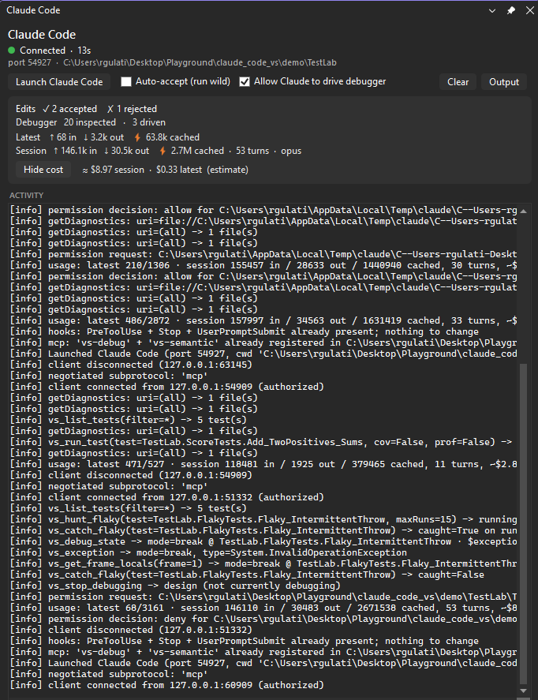
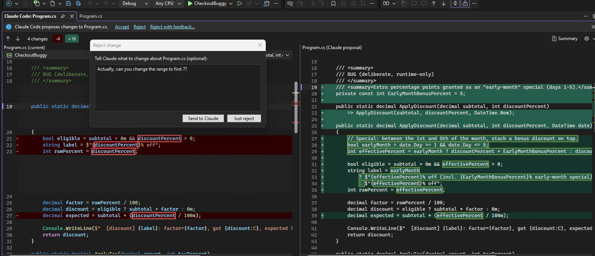
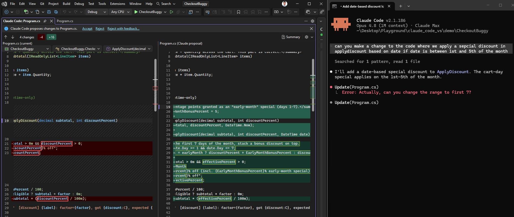
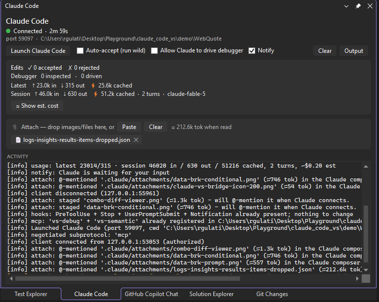

# Getting started

The practical setup: install the extension, launch Claude connected to Visual Studio, and learn the panel and the two safety toggles. For what the tools actually do once you are connected, see [`DEBUGGER.md`](DEBUGGER.md), [`TESTING.md`](TESTING.md), and [`SEMANTIC.md`](SEMANTIC.md).

**Jump to:** [Requirements](#requirements) · [Install](#install) · [First launch](#first-launch) · [The panel](#the-panel) · [The diff gate](#the-diff-gate) · [Auto-accept](#run-wild-auto-accept) · [Attachments](#attachments-screenshots-and-files) · [Notifications](#notifications) · [Let Claude debug](#letting-claude-debug) · [Troubleshooting](#troubleshooting)

---

## Requirements

- **Visual Studio 2026.**
- **The Claude Code CLI**, installed and authenticated. The extension makes no model calls and does no agent work itself, so it needs the CLI. See the [Claude Code docs](https://docs.claude.com/claude-code).
- Tested against `claude` 2.1.191.

---

## Install

- **Marketplace:** search for *Claude Code for Visual Studio* in **Extensions > Manage Extensions**, or install from the [Visual Studio Marketplace](https://marketplace.visualstudio.com/items?itemName=firish.bridgev1).
- **Sideload:** download the `.vsix` from [Releases](https://github.com/firish/claude_code_vs/releases) and double-click it.

---

## First launch

1. Open your project or solution in Visual Studio 2026. Diagnostics and the semantic tools need a loaded project, not a loose file in Open-Folder mode.
2. Open the **Claude Code** panel from **View > Other Windows > Claude Code**. It is also on the **Tools** menu.
3. Click **Launch Claude Code**. A terminal opens running `claude`, already connected to the IDE, so you do not need `/ide`. The panel pill turns green and reads **Connected**.
4. Ask Claude to make a change. Its edit opens as a diff.

On Launch, the extension writes a few helper scripts into your workspace's `.claude/` folder and registers the `vs-debug` and `vs-semantic` MCP servers in your `.mcp.json`, preserving anything already there. The full list is in the README's [Privacy and security](../README.md#privacy-and-security) section.

---

## The panel

The dockable Claude Code panel is your status and control surface.

It shows:

- **Connection.** The green **Connected** pill, the bridge port, and the workspace folder the CLI is bound to.
- **The two safety toggles.** **Auto-accept (run wild)** and **Allow Claude to drive debugger**, both off by default and both reset each session. More on each below.
- **The Notify toggle.** Mutes the in-IDE notifications ("Claude finished responding" / "Claude needs your input"). On by default, since it is a convenience rather than a safety gate. More below.
- **Edit decisions.** How many edits you accepted and rejected this session.
- **Debugger activity.** How many reads Claude made and how many drive commands it issued.
- **Token usage and estimated cost.** The latest call and the running session, in and out tokens plus cached, with a **Show est. cost** toggle. Cost is an estimate from hardcoded per-tier prices, not billing.
- **An activity log** of what crossed the bridge: permission decisions, diagnostics reads, tool calls, and connection events. When something looks off, this is the first place to check, and the **Output** button opens the full pane.

---

## The diff gate

Every edit Claude proposes opens in Visual Studio's own diff viewer, and approving there is the only step. There is no second yes/no prompt in the terminal.

You have three choices on the InfoBar:

- **Accept** applies the change and writes the file.
- **Reject** discards it.
- **Reject with feedback** opens a box where you tell Claude what to change. Your note goes back to the CLI as the reason, and Claude reconsiders with it.

Here the reviewer rejected with "Actually, can you change the range to first 7?", and Claude took the note and re-proposed with the new range.

That round-trip is the point. You steer the edit without retyping the whole request.

---

## Run wild: auto-accept

The **Auto-accept (run wild)** toggle applies edits without opening the diff, for when you want to let it move fast. It is off by default and resets each session, so it is never left on silently. Turn it off to go back to reviewing each edit.

---

## Attachments: screenshots and files

The terminal CLI cannot take a pasted screenshot on Windows (Ctrl+V of a Win+Shift+S capture silently does nothing), and pointing it at files means typing absolute paths. The panel's attach tray covers both. Three ways in:

- **Drop** one or more files from Explorer onto the *"📎 Attach"* card.
- **Paste**: take a screenshot (Win+Shift+S), then click **Paste** - it also takes files you copied in Explorer.
- **Ctrl+V** anywhere in the panel does the same as the button.

Each attachment becomes a chip in the tray, and an `@` reference is pushed straight into the CLI's input box - you will see it appear in the terminal, ready for you to type your question around it and send. Screenshots are saved as PNGs (and the model receives the actual image, not a path guess). Chips stay until you remove them: **click a chip** to @-mention it again (the recovery if you attached while Claude was mid-turn and the reference got dropped), **✕** removes one (deleting our staged copy - files already in your workspace are referenced in place and never touched), **Clear** empties the tray. Anything attached before Claude connects shows ⏳ and sends itself the moment it does.

**The token estimate is the part worth watching.** Chip tooltips and the tray header show what reading the attachment will roughly cost, before you send:

A tight screenshot crop costs a fraction of a full screen (the API downscales big images, so cropping is the only real lever), and a log file announcing *≈212k tokens* is your cue to ask Claude to search it rather than read it whole - it can Grep the staged file directly.

Formats behave three ways: **images (PNG/JPEG/GIF/WebP, ≤5 MB) and PDFs and text files** are read directly; **BMPs** are transcoded to PNG automatically; **everything else** (Excel, video, archives...) still attaches, labeled 🧰 - Claude gets the path and uses a script or tool on it instead of a direct read. Staged copies live in your workspace's `.claude/attachments/` behind a `*` gitignore and are pruned after 7 days.

---

## Notifications

For working in another window while Claude cooks. When a turn finishes, a notification bar appears across the top of the Visual Studio main window ("Claude finished responding.", auto-dismissing after a few seconds). When Claude needs you — a permission prompt in the terminal, or it went idle waiting for input — the bar shows the CLI's message and stays until you dismiss it. If Visual Studio is not the foreground app, its taskbar button also flashes a few times, the standard Windows "needs attention" signal.

Only one notification shows at a time (a new one replaces the old), and the **Notify** toggle in the panel mutes all of it.

---

## Letting Claude debug

Reading runtime state (the call stack, variable values, threads) is always allowed and needs no toggle. Driving the debugger (step, set breakpoints, break at a throw, attach) is opt-in behind **Allow Claude to drive debugger**, which is off by default and resets each session.

To let Claude debug:

1. Set a breakpoint and start debugging with F5, or attach to a running process.
2. Tick **Allow Claude to drive debugger** in the panel.
3. Ask Claude to investigate. While you are paused it already sees the break state, and with the toggle on it can also drive to the fault.

The same toggle gates the test tools that launch the debugger, `vs_debug_test` and `vs_catch_flaky`. Full details are in [`DEBUGGER.md`](DEBUGGER.md) and [`TESTING.md`](TESTING.md).

---

## Troubleshooting

- **Panel says "Waiting for CLI".** Click **Launch Claude Code**, or run `/ide` in a `claude` terminal and pick *Visual Studio*.
- **The debugger, test, or semantic tools are missing.** The panel warns when the `vs-debug` and `vs-semantic` servers did not load for a session. That happens when Claude was launched outside the workspace folder, or the project MCP servers were not approved. Relaunch from the panel, which pins the working directory, and approve the project MCP servers if the CLI prompts.
- **New files land in the wrong folder.** Launch from the extension, which pins the working directory to your workspace, or run `claude` from inside the repo.
- **`getDiagnostics` returns nothing.** Open the code as a project and confirm the error appears in the Error List. Loose files in Open-Folder mode have no compiler analysis.
- **An attachment chip didn't show up in the CLI's input box.** The CLI drops the reference if it was mid-turn (or its agents view was focused) when you attached. Click the chip in the panel to send it again.
- **Filing a bug.** Include the **Output > Claude Code** pane contents and your `claude --version`.
