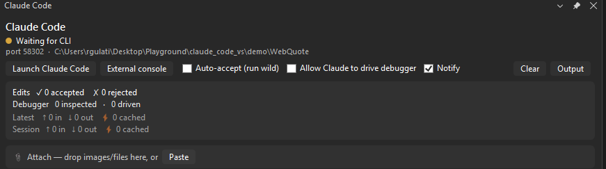

# Quality of life: the terminal, notifications, and attachments

The deep guides ([`DEBUGGER.md`](DEBUGGER.md), [`SEMANTIC.md`](SEMANTIC.md), [`TESTING.md`](TESTING.md)) cover what Claude can *do*. This one covers the features that smooth the daily loop of working with it: where `claude` runs, how you find out it needs you, and how you hand it things that aren't text.

- [Claude in the IDE's own terminal](#claude-in-the-ides-own-terminal) (1.13.0)
- [Notifications](#notifications) (1.11.0)
- [Attach a screenshot, or any file](#attach-a-screenshot-or-any-file) (1.12.0)
- [Troubleshooting](#troubleshooting)

## Claude in the IDE's own terminal

**Launch Claude Code** opens `claude` inside Visual Studio's own docked **Terminal** tool window - the same terminal group as Developer PowerShell - instead of a separate `cmd.exe` console floating over your desktop. It docks, splits, and tabs like any other VS terminal, and it is already connected to the IDE (no `/ide` needed).

Prefer a standalone window? The **External console** button next to Launch starts `claude` in the old separate console instead - useful for a second monitor, or because the docked tab lives and dies with Visual Studio while an external console keeps running after you close the IDE.

### How it works

VS 2026's terminal engine is exposed as a brokered service (`ITerminalService`) that is undocumented - no NuGet package, no docs page - so the extension loads it by reflection from the VS install directory at runtime, the same pattern it uses for the Test Explorer engine. Because an undocumented surface can change or vanish in a VS update, the native launch is guarded end to end: any failure, and any stall longer than ~10 seconds (a cold ServiceHub, for instance), logs a warning to **Output > Claude Code** and falls back to the external console automatically. You always get a terminal.

The launch registers a temporary "Claude Code" terminal profile to carry the command, then deregisters it immediately, so your **View > Terminal** profile dropdown stays clean.

### Known quirks

- **After a VS restart, the old Claude Code tab comes back as Developer PowerShell.** Visual Studio restores terminal tabs across restarts, but always with the default shell - there is no API to opt a tab out, and replaying `claude` would be wrong anyway (the old session's bridge port is stale). Close the leftover tab and click **Launch Claude Code** again.
- **Each click of Launch opens a new tab** (or a new external console), the same as launching twice always has. Each is a separate `claude` session talking to the same bridge.
- **Closing VS closes the docked `claude`.** That is the nature of a docked tab. If you want a session that outlives the IDE, use **External console**.

## Notifications

An in-IDE heads-up for when you are working in another window while Claude cooks:

- **"Claude finished responding."** - when a turn ends, a notification bar appears across the top of the Visual Studio main window (it auto-dismisses after 15 seconds), and if VS is not your foreground app, its taskbar button flashes a few times. The flash is deliberately bounded - a few blinks, then the button stays highlighted - not a nag that blinks until you click.
- **"Claude needs your input."** - when Claude hits a permission prompt or goes idle waiting for you, a bar appears and stays up until you dismiss it (or the next notification supersedes it). It also lands in the panel's activity feed.

One notification shows at a time; a new one replaces the previous. The **Notify** toggle in the panel mutes both. It defaults to **on** - it is a convenience, not a safety gate, so unlike the two safety toggles it does not reset itself each session.

Under the hood, turn-end rides the token-usage hook the extension already installs (no extra hook), and needs-input comes from a small `Notification` hook (`vs-notify-hook.ps1`) that POSTs to the bridge.

## Attach a screenshot, or any file

Pasting a screenshot into the Claude Code CLI on Windows silently does nothing (a [long-open upstream gap](https://github.com/anthropics/claude-code/issues/26679)), and a screenshot is not a file you can drag from anywhere. The panel's attach tray closes that gap:

1. Take your capture (Win+Shift+S), then click **Paste** in the panel (or press Ctrl+V with the panel focused, or drop files from Explorer onto it).
2. The extension stages the attachment and pushes an `@` reference straight into the CLI's input box - the same `at_mentioned` protocol message the official VS Code plugin uses, verified to deliver the actual pixels to the model, not just a path.
3. Type your question around the chip and send.

What makes the tray more than a paste button:

- **Token cost up front.** Every attachment shows an estimated token cost before you send - on the chip's tooltip and totaled next to the tray. A full-screen or 4K shot lands near ~1.5k tokens (the API downscales), a tight crop costs a fraction of that, and a 2 MB JSON log announcing *≈212k tokens* is your cue to ask Claude to Grep it instead of reading it whole.
- **Every format attaches.** Images and PDFs and text are read directly; BMPs are transcoded to vision-ready PNGs; formats Claude cannot read directly (Excel, video, archives) attach as a labeled 🧰 chip - Claude gets the path and reaches for a script or tool on its own. Nothing is hard-rejected.
- **Nothing lands in your repo.** Files already inside your workspace are referenced in place, never copied. Everything else (including pasted screenshots) is staged in `.claude/attachments/` behind a self-ignoring gitignore, and staged copies are pruned after 7 days.
- **Chips are re-sendable.** Click a chip to push its `@` reference again; ✕ removes it (and deletes the staged copy).

Direct-read images must be PNG/JPEG/GIF/WebP under 5 MB; bigger ones still attach, with a downscale note.

## Troubleshooting

- **`claude` opened in a separate console window instead of the docked terminal:** the native path failed or timed out and fell back - the reason is logged in **Output > Claude Code** (look for "Native VS terminal"). Everything still works; the fallback is by design.
- **The Claude Code terminal tab turned into Developer PowerShell after restarting VS:** expected - see [Known quirks](#known-quirks). Close it and Launch again.
- **An attachment chip didn't show up in the CLI's input box:** the CLI drops the reference if it arrived mid-turn or while its agents view was focused. Click the chip to send it again; chips staged before Claude connects send themselves on connect.
- **No notifications:** check the **Notify** toggle in the panel, and note the taskbar flash only happens when VS is *not* the foreground window.
