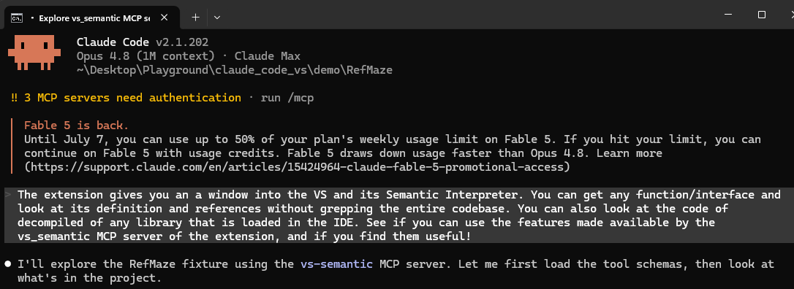
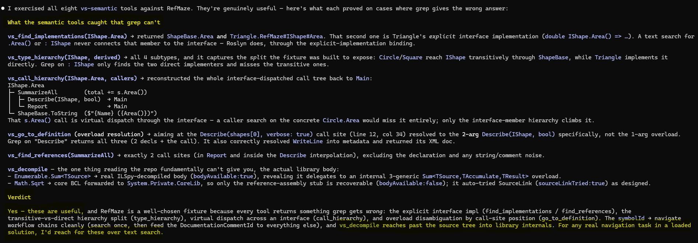

# Semantic code navigation

Most coding assistants read your source and search it with text (grep or ripgrep). This extension also gives Claude Visual Studio's **resolved semantic model** of the code, which is Roslyn's own understanding of symbols, references, implementations, and type and call hierarchies. So "where is this used", "which overload", and "what implements this" come back as ground truth, not a text guess that over-counts or under-counts.

It is the third axis of what an IDE knows, alongside the two the extension already exposed.

| Axis | What it is | Surfaced by |
|---|---|---|
| **Runtime state** | where execution is, variable values, threads, heap | the debugger and ClrMD tools ([`DEBUGGER.md`](DEBUGGER.md)) |
| **Diagnostics** | compiler errors and warnings | `getDiagnostics` (Error List) |
| **Semantic model** | symbols, references, implementations, hierarchies | the `vs-semantic` tools, this doc |

The `claude` CLI does the agent work. The extension exposes Roslyn to it over the same localhost bridge that powers the diff, diagnostics, and debugger features.

**Jump to:** [Watch it work](#watch-it-work) · [Why it beats grep](#why-this-beats-grep) · [Read a library body (`vs_decompile`)](#reading-library-bodies-vs_decompile) · [Workflows it unlocks](#two-workflows-it-unlocks) · [Tool catalog](#tool-catalog)

**Reference:** [How it reaches the model](#how-it-reaches-the-model-a-third-mcp-server) · [Limitations](#limitations) · [Fixtures to try](#fixtures-to-try)

---

## Watch it work

Point Claude at a C# solution and it navigates by the compiler's answer instead of by text. Here it is against [`demo/RefMaze`](../demo/RefMaze), a small reference maze built so every tool returns something grep gets wrong: an `IShape` interface with three implementors (one of them an explicit interface implementation), a `ShapeBase` split, an overloaded `Describe`, and a `Main → Report → SummarizeAll → IShape.Area()` call chain.



It exercised all eight `vs-semantic` tools and reported what each one caught that a text search cannot.



The highlights, each a case grep gets wrong:

- **find-implementations** of `IShape.Area` returned `ShapeBase.Area` and Triangle's **explicit** implementation, `Triangle.IShape.Area`. A search for `.Area()` or `: IShape` never ties that member to the interface. Roslyn does, through the explicit-implementation binding.
- **type-hierarchy** of `IShape` returned all four subtypes and captured the split the fixture was built to expose: `Circle` and `Square` reach `IShape` transitively through `ShapeBase`, while `Triangle` implements it directly. Grep on `: IShape` finds only the two direct implementers.
- **call-hierarchy** of `IShape.Area` reconstructed the interface-dispatched caller tree back to `Main`. The `s.Area()` call is a virtual dispatch through the interface, so a caller search on the concrete `Circle.Area` would miss it. Only the interface-member hierarchy climbs it.
- **go-to-definition** on `Describe(shapes[0], verbose: true)` resolved the two-arg overload specifically, not the three declarations a grep for `Describe` returns.
- **decompile** read `Enumerable.Sum`'s real body out of the library, and for `Math.Sqrt`, a core BCL type, it recovered the reference-assembly stub and tried SourceLink, as designed.

None of that comes from reading your repo. It comes from the compiler's resolved model, and it needs no debug session. It works the moment a C#/VB solution is loaded.

---

## Why this beats grep

Text search is the assistant's single most common operation ("where is this used") and one of its least reliable. Grep misses indirect references: a call through an interface, a virtual dispatch, an explicit interface implementation, a type alias, a `using static`. It over-counts, matching comments, strings, and unrelated same-named symbols (ten `Helper`s, five `Save()` overloads). And it cannot disambiguate: `Describe(` returns every overload for any call site.

Roslyn resolves all of that against the real compilation. The `vs-semantic` tools turn a long, error-prone chain of grep-and-read into one authoritative answer.

---

## Reading library bodies: `vs_decompile`

This is the headline of the semantic surface, and the one thing reading the repo fundamentally cannot do: show the body of a method that lives in a referenced DLL with no source, like `JsonConvert.SerializeObject`, `Enumerable.Where`, or `String.Substring`. The CLI can grep your code. It can never read what a library call actually does. `vs_decompile` can.

It works the way Go-To-Definition does, by reusing Visual Studio's own metadata-as-source service (ILSpy under the hood), with no new dependency, just reflection against the already-loaded Roslyn. Address the symbol by `symbolId` (for example `T:System.Linq.Enumerable`, or the `symbolId` that `vs_go_to_definition` or `vs_get_selection` hand back for a metadata symbol) or by `file` and `line` on a call site. By default you get just the requested member, its declaration and doc comments; `wholeType:true` returns the whole containing type. Output is capped and signaled.

There are three source paths, each marked in the result (`source` is `decompiled` or `source`, plus `bodyAvailable`):

| Target | Path | Result |
|---|---|---|
| `JsonConvert.SerializeObject` (NuGet) | ILSpy decompile of the `lib/` DLL | real body |
| `Enumerable.Where` (framework) | ILSpy decompile of the runtime implementation | real body (`WhereArrayIterator` and the fast paths), not a ref-assembly stub |
| `String.Substring` (core BCL) | stub, then a SourceLink auto-retry | the real .NET runtime source |

The core BCL wrinkle is handled. Core BCL types (`String`, `Int32`, and so on) are type-forwarded to `System.Private.CoreLib`, whose implementation the decompiler cannot resolve from the project's references, so they decompile to a signature-only stub. The tool detects this (`bodyAvailable:false`) and automatically retries via SourceLink (`NavigateToSourceLinkAndEmbeddedSources`), which fetches the real source from `dotnet/runtime` at the exact commit. That retry is bounded to 20 seconds, so an offline or slow symbol server cannot hang the call, and it is skipped when the body decompiled fine. Pass `preferSource:true` to go SourceLink-first (real source for everything that has it, at the cost of a network round-trip). Offline, a core-BCL symbol returns the stub with `bodyAvailable:false` and `sourceLinkTried:true`, so it is honest, never a silent stub masquerading as a body.

---

## Two workflows it unlocks

The tools compose. `vs_search_symbols` (or `vs_get_selection`) yields a `symbolId`, and everything else consumes one. Two end-to-end examples of how that changes what the agent can do.

### "I am about to change `Area()`. What is the blast radius?"

Impact analysis that grep can only approximate:

1. `vs_search_symbols("Area")` gives the `IShape.Area` member, `symbolId: M:RefMaze.IShape.Area`.
2. `vs_find_implementations(M:RefMaze.IShape.Area)` gives every implementor, including `ShapeBase.Area` (abstract) and the explicit `Triangle.IShape.Area`, the one a `grep "\.Area"` cannot tie back to the interface.
3. `vs_call_hierarchy(M:RefMaze.IShape.Area, callers)` gives the transitive caller tree, `SummarizeAll` back through `Report` and `Describe` to `Main`, plus the surprise caller `ShapeBase.ToString`. That is the real set of places to re-test, derived semantically, not guessed from text.

Where grep would over-count (every `.Area` in comments, strings, and unrelated types) and under-count (missing the interface-dispatched and explicit-impl call sites), this is the exact, complete answer.

### "What does this library call actually do?"

The capability that has no grep equivalent at all, reading a body that is not in your repo:

1. The agent sees `JsonConvert.SerializeObject(order)` and wants to know what it does. It cannot, because that body lives in `Newtonsoft.Json.dll`.
2. `vs_go_to_definition` on the call site resolves the metadata symbol and hands back its `symbolId`, `M:Newtonsoft.Json.JsonConvert.SerializeObject(System.Object)`.
3. `vs_decompile` on that `symbolId` returns the real decompiled body: `return SerializeObject(value, (Type?)null, (JsonSerializerSettings?)null);`.

Point it at `String.Substring` instead and it decompiles to a stub, then auto-fetches the real .NET runtime source via SourceLink. Either way the agent reads what the call does instead of guessing from the name.

---

## How it reaches the model: a third MCP server

The IDE-integration protocol (the WebSocket the CLI connects to) is curated by the CLI. It surfaces only `getDiagnostics` (and `executeCode`) and drives the rest itself, so a tool added there would never be called. So, exactly like the debugger's pull channel, these tools live on a user-registered MCP server, the open plugin door the CLI surfaces in full.

There are now two such servers, both backed by the same stdio shim (`vs-mcp-shim.ps1`) with a different `-Route`, both reaching the bridge's localhost `HttpListener`:

```
  Claude (CLI) --stdio JSON-RPC--> vs-mcp-shim.ps1 -Route /mcp           --> POST /mcp           --> vs-debug    (runtime tools)
               --stdio JSON-RPC--> vs-mcp-shim.ps1 -Route /mcp-semantic  --> POST /mcp-semantic  --> vs-semantic (Roslyn tools)
                                                                                      |
                                                                                      v
                                                              RoslynReader  --VisualStudioWorkspace-->  Roslyn semantic model
```

`McpInstaller` registers both servers in your workspace `.mcp.json` at Launch (a one-time CLI trust prompt for the new one). The tools run in-proc in C# against the live `VisualStudioWorkspace`. The shim is a dumb pipe.

**Threading is inverted from the debugger.** The EnvDTE debugger path is UI-thread-bound end to end, but the Roslyn `Solution` is an immutable, free-threaded snapshot. The tools take the workspace handle on the UI thread, then hop off it for the heavy `SymbolFinder` query, so navigation never stalls the editor.

---

## Tool catalog

All tools live on the `vs-semantic` MCP server and appear to the model as `mcp__vs-semantic__*`. They are read-only and ungated (no execution, no mutation), managed (C#/VB) only, and each returns `{"available":false}` when no project is loaded.

### Addressing: how you name a symbol

Every navigation tool takes either:

- `symbolId`, a stable Roslyn DocumentationCommentId (for example `M:RefMaze.IShape.Area`, `T:RefMaze.Circle`), preferred, obtained from `vs_search_symbols`; or
- `file` and `line` (and an optional `column`), cursor-style, which resolves the symbol referenced at that position and is ideal for disambiguating a specific call site.

The intended workflow is search, take the `symbolId`, then navigate.

| Tool | What it returns |
|---|---|
| `vs_get_selection` | What the user currently has selected (or where the caret is) in the active editor: selected text, file, and range, plus the Roslyn symbol at that position with its `symbolId` when the file is in the loaded solution. Lets the model act on "this" and navigate straight from it (selection to `symbolId` to references or callers). The selection read works in any language; the symbol enrichment is C#/VB. |
| `vs_search_symbols` | Declarations whose name contains the query (case-insensitive), each with a `symbolId`, kind, signature, container, and source `file:line`. The addressing primitive and the semantic "where is X declared". |
| `vs_find_references` | All references to a symbol across the solution, each as `file:line:column` plus a code snippet, resolving through interfaces, overrides, partials, and generics, with comments and strings excluded. |
| `vs_go_to_definition` | The resolved symbol's declaration(s), signature, and XML doc, the right one among overloads or many same-named types. Metadata-only symbols report the defining assembly. |
| `vs_find_implementations` | Concrete implementations of an interface or interface member, overrides of an abstract or virtual member, or derived classes of a base. Exact, via Roslyn. |
| `vs_call_hierarchy` | `direction:"callers"` (default): who transitively calls a method, as a depth-limited, cycle-guarded tree with call sites, for impact analysis. `direction:"callees"`: what the method directly calls (depth 1). |
| `vs_type_hierarchy` | `direction:"derived"` (default): subtypes and implementors. `direction:"base"`: the base-class chain and implemented interfaces. |
| `vs_decompile` | A framework or NuGet symbol with no source (a method or type in a referenced DLL), returned as decompiled C#. The one thing reading the repo cannot give you. See [above](#reading-library-bodies-vs_decompile). |

Output is bounded but signaled. Large results are capped (references 200, implementations and hierarchy 120, search 80, caller depth 3) and carry `{"truncated":true,"note":"..."}` so the model knows to narrow its query.

---

## Limitations

- **Managed (C#/VB) only.** Roslyn has no C++ model. C++ build diagnostics still flow through the Error List, but C++ navigation is not covered.
- **Needs a loaded project.** Loose files in Open-Folder mode have no Roslyn workspace, so the tools return `{"available":false}`. Same caveat as diagnostics.
- **Scope is the solution loaded in Visual Studio**, not the CLI's working directory. If they differ, the tools see what Visual Studio has open.
- **`callees` is direct-only (depth 1).** Transitive callees are not reconstructed; read the source or use `callers` from the other end. `callers` is transitive.
- **Generated and source-gen symbols** resolve, but their locations may point at generated files.
- **No mutation.** Rename, refactor, and code-fixes are deliberately out of scope, since they would cross the diff-gate boundary. This surface is navigation and comprehension only.

---

## Fixtures to try

Open [`demo/RefMaze/RefMaze.sln`](../demo/RefMaze) in Visual Studio 2026, Launch Claude Code, and ask Claude to map the `IShape` hierarchy, find every implementor, or trace who calls `Area()`. Then compare against `grep IShape` and `grep Area`. The maze's own comments name what each tool should prove.

---

## What is next

- **Transitive callees**, for the full call graph in both directions.
- **Symbol rename and safe refactors**, routed through the existing diff gate so each edit is still a single accept or reject.
- **Roslyn-precise diagnostic spans.** The same `VisualStudioWorkspace` can power tighter `getDiagnostics` ranges (see [`ROADMAP.md`](../ROADMAP.md)).
