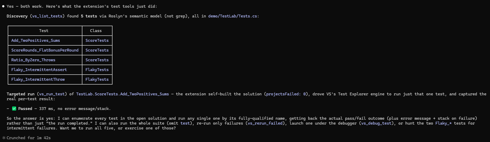
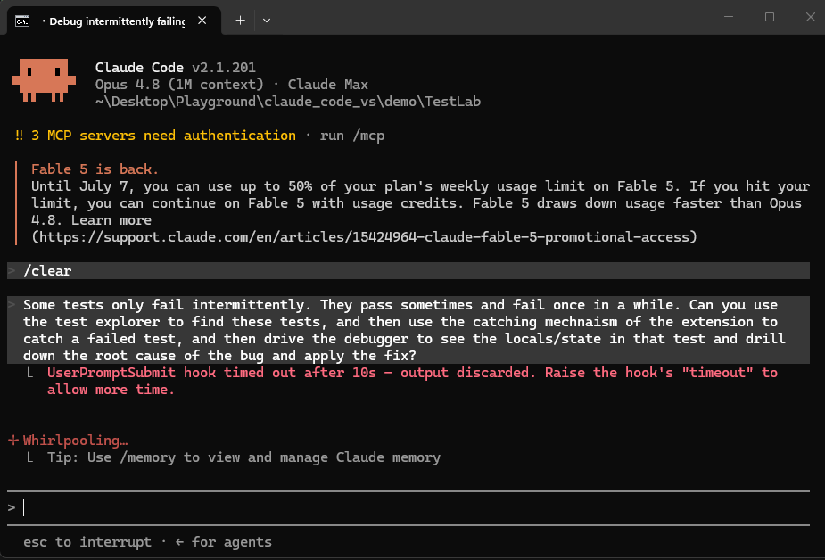
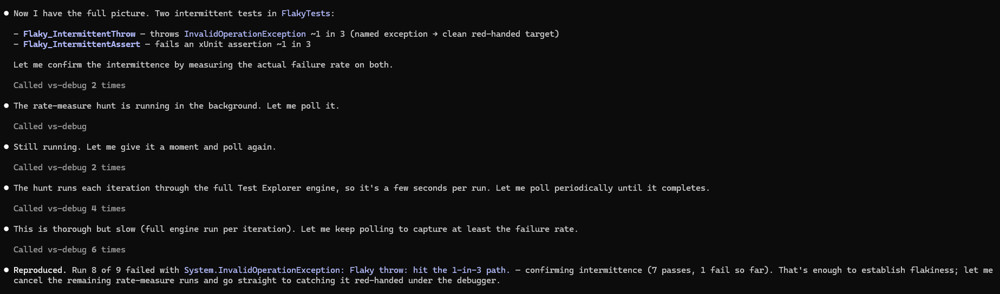
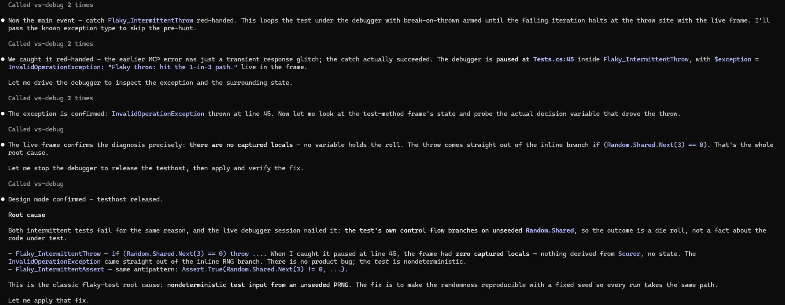
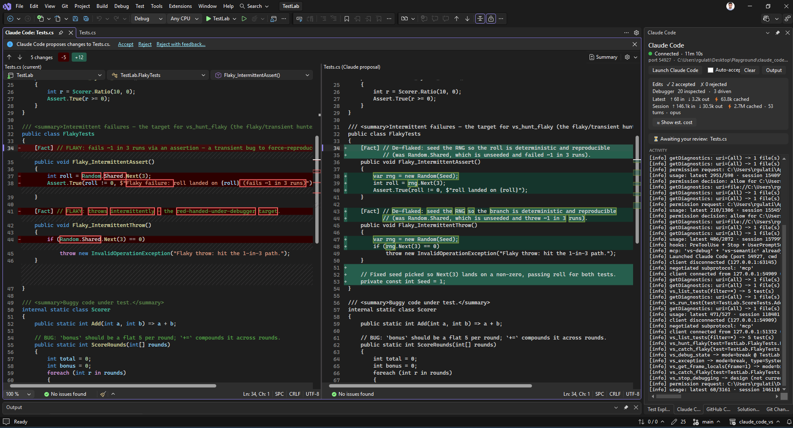

# Test integration: the fix-verify loop

`dotnet test` runs your tests, and the `claude` CLI can already shell out to it. What it cannot do is run one failing test **under Visual Studio's debugger and stop at the fault** with the live frame, or **hammer a flaky test until it fails and catch that exact run**, paused inside the failure. This extension gives Claude Visual Studio's own **Test Explorer engine**, wired to the live debugger, which turns "run the tests" into a closed loop: run, fix, verify, and catch.

The composition is the point. The test engine sits on top of the debugger, so a failing test is not just a red line. Claude can break into it at the throw with `$exception` and the locals live, and it can reproduce an intermittent failure on purpose and be paused inside it.

| Axis | What it is | Surfaced by |
|---|---|---|
| **Runtime state** | execution point, variable values, threads, heap | the debugger and ClrMD tools ([`DEBUGGER.md`](DEBUGGER.md)) |
| **Semantic model** | symbols, references, implementations, hierarchies | the `vs-semantic` tools ([`SEMANTIC.md`](SEMANTIC.md)) |
| **Diagnostics** | compiler errors and warnings | `getDiagnostics` (Error List) |
| **Tests** | discover, run, **debug**, and **force-reproduce** | the test tools, this doc |

The `claude` CLI does the agent work. The extension exposes Test Explorer's engine to it over the same localhost bridge that powers the diff, diagnostics, debugger, and semantic features.

**Jump to:** [Watch it work](#watch-it-work) · [Run and real results](#run-the-tests-and-get-real-results) · [Catch a flaky test](#catch-a-flaky-test-red-handed) · [Why it beats `dotnet test`](#why-this-beats-dotnet-test) · [The loop](#the-fix-verify-loop) · [Tool catalog](#tool-catalog)

**Reference:** [How it works](#how-it-works) · [Limitations](#limitations) · [Fixtures to try](#fixtures-to-try)

---

## Watch it work

[`demo/TestLab`](../demo/TestLab) is a small xUnit project where each tool has a clean target: one test passes, one fails an assertion, one throws, and two fail about one run in three (one by throwing, one by asserting).

| Test | Designed to |
|---|---|
| `ScoreTests.Add_TwoPositives_Sums` | pass, as a baseline |
| `ScoreTests.ScoreRounds_FlatBonusPerRound` | fail an assertion (a per-round bonus that should reset compounds instead, so `Assert.Equal(45, …)` gets 60) |
| `ScoreTests.Ratio_ByZero_Throws` | throw a `DivideByZeroException` |
| `FlakyTests.Flaky_IntermittentThrow` | throw about 1 run in 3 (`InvalidOperationException`) |
| `FlakyTests.Flaky_IntermittentAssert` | assert-fail about 1 run in 3 |

### Run the tests, and get real results

Claude discovers the tests with Roslyn, so it needs no build just to list them, then runs one or all through Test Explorer's own engine. It self-builds the solution first, so you never have to build by hand. What comes back is real per-test data: outcome, error message, stack, and duration, not a text blob to parse.

Here it found all five tests, ran `Add_TwoPositives_Sums` on its own, and reported `Passed` in 337 ms. A failing test comes back with the assertion diff or the exception and the stack, one entry per test. After a fix, `vs_rerun_failed` re-runs only the tests that failed last time instead of the whole suite.

### Catch a flaky test red-handed

This is the one motion nothing else can do, not `dotnet test`, not a re-run loop. `Flaky_IntermittentThrow` throws about one run in three. A re-run loop gives you a different red line each time. Catching it under the debugger leaves you paused inside the failing run, holding the state that caused it.

Claude reproduced the failure once with the flaky hunter to learn what to break on, then armed break-on-thrown for that exception and ran the test under the debugger over and over. Passing runs finished and it moved on.

The first failing run threw, and the debugger halted at the throw. It caught it paused at `Tests.cs:45` inside `Flaky_IntermittentThrow`, with `$exception` live in the frame, the `InvalidOperationException` and its message right there in the Locals window.

Then it read the frame, and the cause is a good twist. There are no captured locals. Nothing holds the roll. The throw comes straight out of the inline branch `if (Random.Shared.Next(3) == 0)`. The test is not exposing a product bug. The test itself is nondeterministic, because it branches on an unseeded `Random.Shared`, and both flaky tests fail for the same reason.

The fix is to make the randomness reproducible with a fixed seed, so every run takes the same path, and that opened in the diff.

None of that is reachable from `dotnet test`. The value is being paused inside the exact failing run, reading the frame that produced it.

---

## Why this beats `dotnet test`

Running a test and getting pass or fail is table stakes, and the CLI can do that itself. The value here is everything that needs the IDE and its debugger, which a shell-out cannot reach.

- **Debug one test under Visual Studio.** `dotnet test --filter X` runs a test but cannot stop inside it. `vs_debug_test` launches a single test under the real debugger, and with break-on-thrown armed it halts at the throw site, not the catch that swallowed it, with the call stack, args, and `$exception` live.
- **Catch a transient bug red-handed.** `vs_catch_flaky` loops a flaky test under the debugger until the failing run happens and stops on it. A re-run loop gives you a different red line each time. This leaves you paused inside the failure with the state that caused it.
- **Real per-test results, structured.** `vs_run_test` returns each test's `outcome`, `errorMessage`, `errorStackTrace`, and `durationMs` as data, through Test Explorer's own result stream, not a text blob to parse.
- **It composes.** Every result feeds the debugger tools you already have, `vs_debug_state`, `vs_get_frame_locals`, `vs_exception`, because the test engine and the debugger are the same session.

Table stakes are here too (discover, run one or all, re-run failures, coverage), but the reason this exists is the debugger composition.

---

## The fix-verify loop

1. **Discover.** `vs_list_tests` finds the tests via Roslyn, so it needs no build to list them.
2. **Run.** `vs_run_test` runs one or all and returns real per-test outcomes. `collectCoverage:true` attaches a `.coverage` file.
3. **Fix, then verify.** `vs_rerun_failed` re-runs only the last run's failures instead of the whole suite.
4. **Corner a deterministic failure.** `vs_debug_test` launches the one failing test under the debugger. Pair it with `vs_break_on_thrown` to stop at the fault, then read it with the debugger tools.
5. **Corner a transient failure.** `vs_hunt_flaky` force-reproduces it and captures each failing run. `vs_catch_flaky` catches it red-handed and leaves you paused on it.

Steps 4 and 5 are the payoff. A bug that only shows up sometimes goes from "I cannot reproduce it" to "the debugger is paused on it."

---

## Tool catalog

The test tools live on the `vs-debug` MCP server, co-located with the debugger tools on purpose, because the point is that they compose. They appear to the model as `mcp__vs-debug__*`, and they target managed (.NET) test projects.

| Tool | What it does | Gated |
|---|---|---|
| `vs_list_tests` | Discover tests via Roslyn (methods marked `[Fact]`, `[Theory]`, `[Test]`, `[TestMethod]`, `[TestCase]`), returning real fully-qualified names. No engine callback, no build needed to list. | no |
| `vs_run_test` | Run one (by FQN) or all. Returns per-test `{outcome, errorMessage, errorStackTrace, durationMs}` plus the overall status. `collectCoverage:true` attaches a `.coverage` file. Self-builds first. | no |
| `vs_rerun_failed` | Re-run only the tests that failed in the last run (`Scope.ForState(Failed)`), the classic fix-verify move. | no |
| `vs_debug_test` | Launch one test under the Visual Studio debugger. Pair with `vs_break_on_thrown` to stop at the fault with live locals. | yes, drive |
| `vs_hunt_flaky` | Force-reproduce a flaky failure: hammer a test until it fails (or hits `maxRuns`), capturing each failing run's real outcome, message, and stack. Runs in the background and hands back a `huntId` if it exceeds a ~40s inline window. `measureRate:true` runs all `maxRuns` to estimate the rate. | no |
| `vs_hunt_result` | Poll a background hunt by `huntId` for live progress and the terminal verdict. | no |
| `vs_hunt_cancel` | Stop a background hunt. | no |
| `vs_catch_flaky` | Catch red-handed: loop a test under the debugger with break-on-thrown armed until the failing run halts at the throw, paused for inspection. Auto-learns the exception type. | yes, drive |

Results and progress are bounded but signaled. Call stacks are capped with a `{truncated}` marker, and hunts surface `inconclusiveRuns`, `attempts`, and under-sampling, so a verdict is never quietly built on too few runs.

---

## How it works

Two things are worth knowing.

**Real per-test results come through an emitted callback.** Visual Studio's test engine reports pass or fail only through an internal result-callback interface, `ITestWindowDataCallback`. Its `RunTestsAsync` return value is identical for pass and fail, since it means "the run completed", not "the tests passed". You cannot implement an internal interface in C# or with `DispatchProxy`, so the extension uses `Reflection.Emit` to build a type that implements it (with `[IgnoresAccessChecksTo]`) and forwards each streamed `TestNodeData`. That is how `vs_run_test` gets the real outcome, message, and stack instead of a bare bool. The engine itself is acquired in-proc via MEF (`IRequestFactory`), the same path Visual Studio's own Test Explorer uses.

**Long hunts run as start-and-poll, not a held request.** The `vs-debug` tools reach the model over an HTTP shim with a roughly 60-second per-request timeout, so a multi-minute `measureRate` hunt cannot hold the request open the way `openDiff` defers on the persistent WebSocket. `vs_hunt_flaky` starts the hunt on a background task, waits up to 40 seconds inline for the fast case, and otherwise hands back a `huntId` you poll with `vs_hunt_result`, so the hunt outlives the request and never times out.

---

## Limitations

- **Managed (.NET) test projects.** Discovery is Roslyn (C#/VB test attributes), and the run and debug engine is the managed Test Explorer path. C++ tests are not covered.
- **Needs a loaded solution or project**, not loose files. The engine and the Roslyn workspace both key off what is open in Visual Studio, not the CLI's working directory if they differ.
- **`profile:true` is deferred.** `TestHostMode.Profile` needs a Diagnostics-Hub `ProfilerToolId` that is not wired yet, so the tool returns an honest note rather than a silent cancel. Coverage works.
- **`measureRate` can under-sample on churn.** The engine cancels rapid back-to-back runs. Those are retried and never counted as passes, but a long rate measurement can hit its budget under-sampled, which the result surfaces. The clean fix, waiting on `IOperationState` for engine-idle between runs, is a follow-up.
- **`vs_catch_flaky` needs the drive toggle**, and for a bare assertion with no framework hint, an explicit `exception`. It leaves the session paused on a catch by design, with break-on-thrown still armed, so clear it with `vs_break_on_thrown enabled:false` after inspecting.
- **`vs_debug_test` and `vs_catch_flaky` are managed-debugger only** and target first-chance exceptions. They do not catch a silent wrong-value assertion that never throws; for those, use `vs_run_test` and then `vs_debug_test` at a breakpoint.

---

## Fixtures to try

Open [`demo/TestLab/TestLab.slnx`](../demo/TestLab) in Visual Studio 2026, Launch Claude Code, and:

1. Ask Claude to **run the tests**. Watch it report the assertion diff and the exception, per test.
2. Ask it to **hunt the flaky one** (`Flaky_IntermittentThrow`). It reproduces the roughly 1-in-3 failure and captures it.
3. Tick **Allow Claude to drive debugger**, then ask it to **catch that flaky test red-handed**. It loops under the debugger and pauses you at the throw with `$exception` live.

---

## What is next

- **Run the tests affected by a change.** `Scope.ForFile` and `Scope.ForSymbol` plus the `vs-semantic` call graph: run the tests that touch the code you just edited.
- **Profiling.** Wire the `ProfilerToolId` so `profile:true` runs under the CPU and allocation profiler.
- **Idle-wait between hunt runs.** Replace the settle delay with an `IOperationState` engine-idle wait, so `measureRate` never under-samples.
